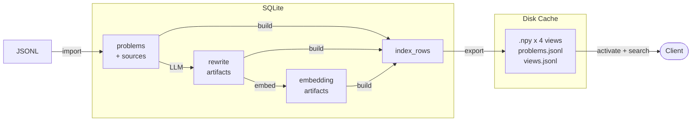

# Irminsul

Irminsul is a competitive programming problem search engine and an alternative implementation of [yuantiji.ac](https://github.com/fjzzq2002/is-my-problem-new).

## What is new?

LLM-based retrieval is now mature and accessible, but the hard part in a real deployment is the quality of the crawled data behind it. PDF statements often need OCR or encoding repair, and extraction errors can change the meaning of a problem.

Irminsul treats *data repair* as a first-class workflow: problems, rewrites, and embeddings are managed independently, then composed into immutable search indexes on demand. When crawled statements are corrected or refreshed, only the affected artifacts need to be regenerated.

> What is [Irminsul](https://genshin-impact.fandom.com/wiki/Irminsul)?

## Data Flow



### Admin workflow

Upload JSONL, review the dry run, confirm the import, build an index, and activate it. Each step is incremental: re-importing updates only changed problems, and rebuilding reuses existing rewrites and embeddings whenever possible.

Use the admin **Jobs** page to inspect failed or blocked jobs.

If a problem repeatedly fails during rewrite or embedding, edit, translate, or disable it from the admin UI, then start a new job. Existing jobs use fixed snapshots, so they will not pick up edits made after the job was created.

> **Note**: the API provider matters. In our experiments, the official DeepSeek V4 Flash API produced significantly more reliable rewrite results (0.5% error rate) than the same model routed through OpenRouter (>2% error rate).

### JSONL format

```json
{"id": "CodeForces/1A", "title": "Theatre Square", "text": "...", "url": "https://..."}
```

| Field   | Required | Description                      |
|---------|----------|----------------------------------|
| `id`    | yes      | Unique problem identifier        |
| `title` | no       | Display title (defaults to `id`) |
| `text`  | yes      | Problem statement                |
| `url`   | no       | Link to original problem         |

See `sample_data/` for reference JSONL files.

## Quickstart

### Prerequisites

- Python 3.11+
- Node.js 18+

### Install

```bash
pip install -r requirements.txt
cd frontend && npm install && npm run build && cd ..
```

### Create credentials

```bash
mkdir -p data

# Admin password hash
python -c "from core import hash_password; print(hash_password('replace-me'))" > data/admin_password.hash

# Session signing secret
python -c "import secrets; print(secrets.token_urlsafe(48))" > data/admin_signing_secret

# Linux/macOS only
chmod 600 data/admin_password.hash data/admin_signing_secret
```

Use your real admin password instead of `replace-me`.

### Configure API keys

Create a `.env` file:

```env
DEEPSEEK_API_KEY=sk-...
OPENROUTER_API_KEY=sk-...
DEEPINFRA_API_KEY=...
```

### Run

```bash
uvicorn app:app --host 127.0.0.1 --port 8000 --workers 1
```

- Public search: `http://localhost:8000/`
- Admin UI: `http://localhost:8000/admin`

> **Do not** run multiple Uvicorn workers against the same SQLite database.

## Configuration

All configuration is in `config.toml`. See the file for the full reference. Key sections:

| Section        | Purpose                              |
|----------------|--------------------------------------|
| `[storage]`    | Database and cache paths             |
| `[admin]`      | Session duration, credential files   |
| `[models.*]`   | LLM / embedding / rerank endpoints   |
| `[search]`     | Retrieval limits, beta, rerank       |
| `[index_cache]`| `load_mode` (`mmap` or `ram`)        |
| `[audit]`      | Search audit retention and pricing   |

## Backup

Back up these paths together:

```
data/app.sqlite3
data/app.sqlite3-wal
data/app.sqlite3-shm
data/uploads/
data/index_cache/
config.toml
```

Do not commit `data/`, `*.sqlite3`, `*.npy`, `frontend/dist`, or credential files.

## Recovery

On startup the service automatically:

- Moves interrupted `running` jobs back to `queued`
- Resets `running` artifacts back to `pending`
- Removes stale `.building` cache directories
- Loads the active index from the database
- Starts the background job worker


## Development

### Tests

```bash
python -m pytest tests -q -p no:cacheprovider
```

### Frontend

```bash
cd frontend && npm run build
```

### Architecture

Single process, single SQLite database (WAL mode), single background job worker thread.

```
app.py       - FastAPI routes, admin auth, index activation
core.py      - Settings, DB helpers, schema, CRUD
pipeline.py  - Import, rewrite, embedding, build index, cache export
search.py    - API clients, search pipeline, audit
frontend/    - Vanilla TypeScript + Vite, PicoCSS admin UI
AGENTS.md    - Working conventions for future agents
PLAN.md      - Current implementation plan and design notes
```
